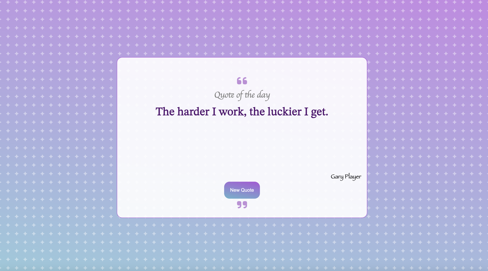

# .png>) Quote generator

# Description

This is a simple yet powerful Random Quote Generator that delivers inspirational quotes to uplift your day and fuel your spirit to win every battle. ✊

Each quote is accompanied by the author's name, providing context and credit to the great minds behind the words.

### Link 👉 [check live preview ](https://vandanafuloria.github.io/random-quote-generation/)

# Image



# Installation

1. `Clone this repository`

```
git clone https://vandanafuloria.github.io/random-quote-generation.git
```

2. `Install all dev dependencies`

```
npm install
```

3. ` Build the Project`

```
npm run build
```

4. `Start Dev server`

```
npm run start
```

5. `Deploy Project`

```
npm run deploy
```

# Bundler : Parcel

```
npm install --save-dev parcel
```

- For Development (hot-reloading)

```
parcel index.html
```

- For Deployment

```
parcel build index.html --public-url /your-repo-name/
```

# Api Used

`https://qapi.vercel.app/api/random`

# Contact

You can reach me at:  
📩[vandanafuloria02@gmail.com](mailto:vandanafuloria02@gmail.com)
